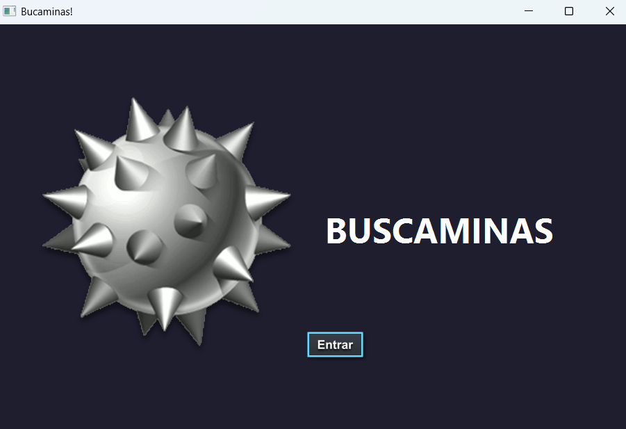
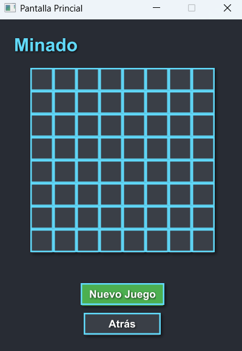
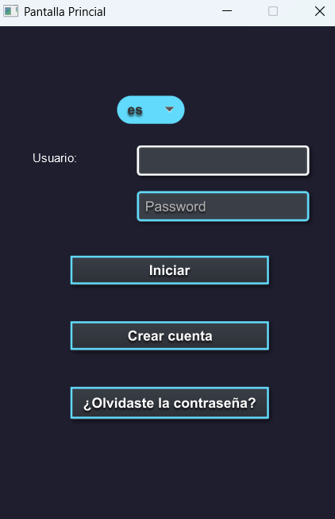
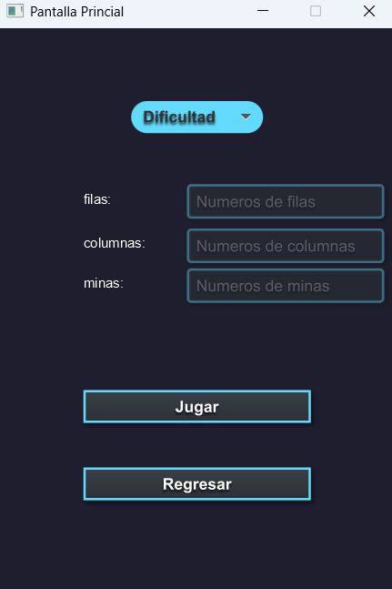
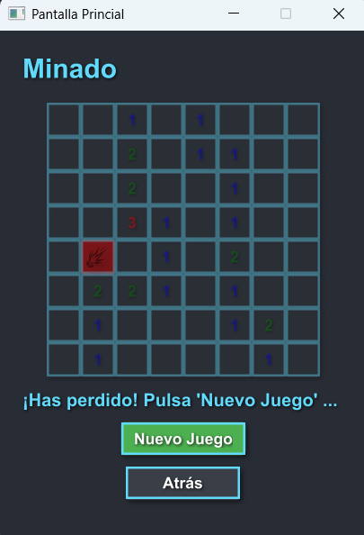

# Buscaminas


## 📖 Descripción del Proyecto

El clásico juego de **Buscaminas**, reinventado con un diseño moderno y opciones personalizables. Este proyecto ofrece una experiencia interactiva y desafiante para los amantes de los juegos de lógica.

### 🎯 ¿Qué problema resuelve?

Proporciona una forma divertida de ejercitar la mente, desarrollando habilidades de lógica y deducción en un entorno digital accesible.

### 👥 ¿A quién está dirigido?

- Jugadores casuales.
- Entusiastas de los juegos de lógica.
- Personas que buscan un pasatiempo entretenido y educativo.

### 🌟 Características Únicas

- **Diseño moderno y atractivo.**
- **Niveles de dificultad personalizables.**
- **Compatible con dispositivos modernos.**

---

## 🛠️ Tecnologías Usadas

- **JavaFX**: Para la interfaz gráfica.
- **CSS**: Para el diseño visual.
- **Maven**: Para la gestión del proyecto y dependencias.

---

## 🎨 Diseño

### **Prototipo Inicial**

*El diseño inicial muestra una estructura básica centrada en la funcionalidad principal del juego.*

### **Diseño Final**

*El diseño final incluye mejoras en la interfaz, colores y una experiencia de usuario más intuitiva.*

---

## 🚀 Instrucciones de Instalación

Sigue estos pasos para ejecutar el proyecto localmente:

1. **Clona el repositorio:**
   ```bash
   git clone https://github.com/nexphernandez/Buscaminas.git
   ```

2. **Navega al directorio del proyecto:**
   ```bash
   cd Buscaminas
   ```

3. **Ejecuta el proyecto con Maven:**
   ```bash
   mvn clean javafx:run
   ```

---

## 🎥 Demo

### **Pantalla de Inicio**


### **Pantalla de Selección de Dificultad**


### **Pantalla de Juego**


### **Pantalla de Derrota**


---

## 📋 Características

| Característica       | Estado       |
|----------------------|--------------|
| Personalización      | ✅           |
| Tablero dinámico     | ✅           |
| Guardado de partidas | ❌           |

---

## 🗺️ Roadmap

- [ ] Añadir soporte para guardado de partidas.
- [ ] Mejorar compatibilidad con diferentes resoluciones de pantalla.
- [ ] Implementar modo multijugador.
- [ ] Añadir traducción a más idiomas.

---

## 🤝 Contribuciones

¡Las contribuciones son bienvenidas! Si deseas colaborar, sigue estos pasos:

1. Haz un fork del repositorio.
2. Crea una rama para tu funcionalidad (`git checkout -b feature/nueva-funcionalidad`).
3. Realiza tus cambios y haz un commit (`git commit -m 'Añadir nueva funcionalidad'`).
4. Haz un push a la rama (`git push origin feature/nueva-funcionalidad`).
5. Abre un Pull Request.

---

## 📄 Licencia

Este proyecto está bajo la licencia [MIT](https://opensource.org/licenses/MIT).

---

## 📧 Contacto

Si tienes preguntas o sugerencias, no dudes en contactarme:

- **Autor:** [nexphernandez](https://github.com/nexphernandez)
- **Correo:** nicolaseh3b1112@gmail.com